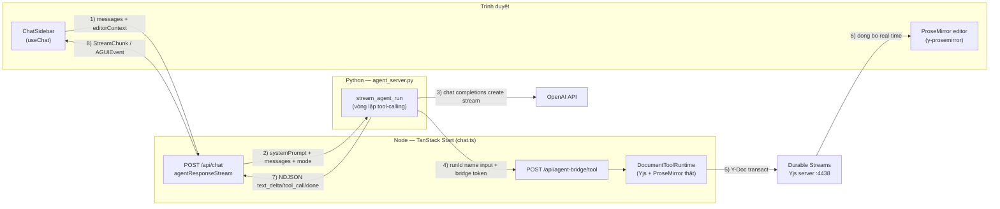
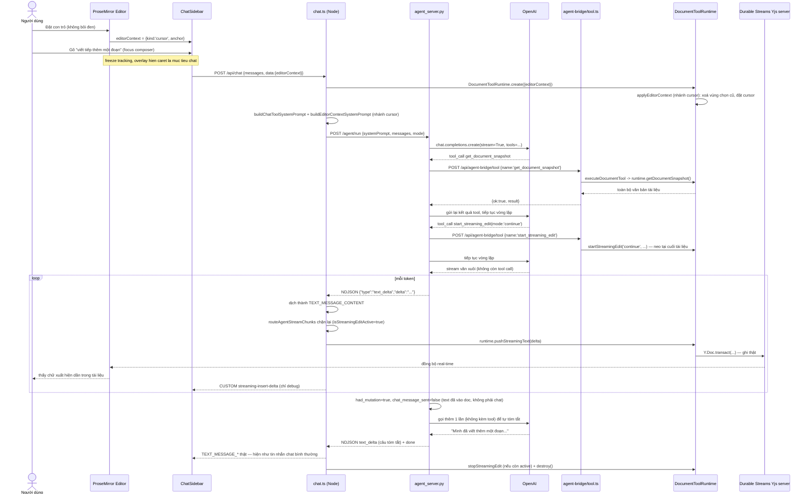
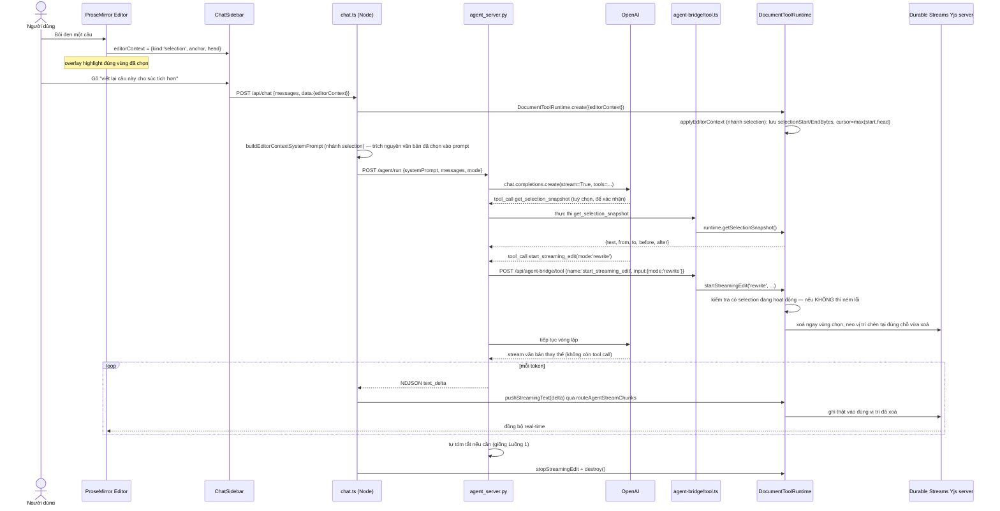

# Hai luồng tương tác chính với AI agent (Electra)

Tài liệu này mô tả **chi tiết, từng bước một, ở mức code thật**, hai luồng
tương tác chính giữa người dùng — trình soạn thảo (ProseMirror/Yjs) — AI
agent trong `collaborative-ai-editor`. Tài liệu được viết cho người **mới**
tìm hiểu dự án, nên có thêm phần giải thích khái niệm nền tảng và chú thích
"vì sao" ở mỗi bước, không chỉ "cái gì".

Hai luồng:

1. **Luồng toàn văn bản** — người dùng chat mà **không bôi đen** gì trong
   tài liệu; agent đọc toàn bộ nội dung rồi viết tiếp/chèn thêm.
2. **Luồng vùng chọn** — người dùng **bôi đen một đoạn văn bản** rồi yêu cầu
   agent chỉnh sửa đúng đoạn đó.

Backend duy nhất hiện nay: Python (`agent_server.py`) quyết định gọi tool,
Node thực thi tool thật qua `DocumentToolRuntime`. Không còn nhánh dự phòng
nào khác trong dự án (bản `@tanstack/ai` cũ đã bị xóa hoàn toàn).

---

## Khái niệm nền tảng cần biết trước

Nếu bạn chưa quen các khái niệm dưới đây, đọc nhanh phần này trước — mọi bước
ở các phần sau đều dùng những từ này liên tục.

- **ProseMirror** — thư viện dựng trình soạn thảo văn bản có cấu trúc (giống
  Google Docs). Tài liệu là một cây các "node" (đoạn văn, tiêu đề, danh
  sách...), không phải một chuỗi HTML/text thô.
- **Yjs / CRDT** — Yjs là thư viện đồng bộ dữ liệu kiểu CRDT (Conflict-free
  Replicated Data Type): nhiều người/nhiều tiến trình có thể cùng sửa một tài
  liệu cùng lúc mà không xung đột, các thay đổi tự động hợp nhất (merge).
  Trong dự án này, tài liệu ProseMirror được gắn (bind) vào một cấu trúc Yjs
  tên `Y.XmlFragment` — **mọi chỉnh sửa thật sự đều là ghi vào cấu trúc Yjs
  này**, sau đó Yjs tự đồng bộ sang tất cả những ai đang mở cùng tài liệu.
- **Anchor (điểm neo) kiểu Yjs relative position** — một vị trí trong tài
  liệu (ví dụ "ngay trước từ X") được mã hoá theo kiểu "tương đối" của Yjs,
  thay vì một con số cố định như "ký tự thứ 42". Lý do: nếu có người khác
  gõ/xoá chữ ở chỗ khác trong lúc bạn đang thao tác, một con số cố định sẽ
  sai lệch ngay lập tức, còn anchor kiểu Yjs tự "trôi" theo đúng vị trí ngữ
  nghĩa ban đầu.
- **Durable Streams** — lớp truyền tải (transport) + lưu trữ (persistence)
  dùng chung cho cả đồng bộ tài liệu (Yjs) lẫn chat: về bản chất là một "dòng
  sự kiện" (stream) chạy qua HTTP thường, có thể "đọc tiếp" (resume) sau khi
  mất kết nối hoặc tải lại trang, thay vì phải bắt đầu lại từ đầu.
- **`docKey` / `sessionId`** — `docKey` xác định bạn đang ở **tài liệu/phòng
  nào**; `sessionId` chỉ là định danh cho **một phiên chat cụ thể**, không
  ảnh hưởng tới quyền truy cập tài liệu (bất kỳ `sessionId` nào cũng mở được
  tài liệu ứng với `docKey` đó).
- **Tool-calling / Function calling** — cách một model AI (LLM) không chỉ trả
  lời bằng chữ mà còn có thể "gọi hàm": model output ra tên một hàm có sẵn
  (ví dụ `insert_text`) kèm tham số dạng JSON; code thật thực thi hàm đó rồi
  gửi kết quả lại cho model để nó tiếp tục suy nghĩ ở lượt kế tiếp. Đây là
  cách agent trong dự án này "chỉnh sửa" tài liệu — **nó không tự viết trực
  tiếp vào tài liệu, nó luôn gọi tool**.
- **System prompt** — đoạn hướng dẫn cố định gửi kèm mỗi lần gọi model, mô tả
  model nên đóng vai gì, có tool gì, quy tắc nào phải tuân theo. Đây không
  phải nội dung người dùng gõ, mà là "luật chơi" lập trình viên định sẵn.
- **Streaming** — thay vì đợi model tạo xong toàn bộ câu trả lời rồi gửi một
  lần, model gửi từng mẩu nhỏ (token/từ) ngay khi vừa sinh ra, giúp người
  dùng thấy chữ "chạy" dần trên màn hình thay vì đợi rồi hiện ra một cục.
- **`StreamChunk` / `AGUIEvent` / `CUSTOM` event** — định dạng chuẩn của "một
  mẩu tin" trong dòng stream, ví dụ: "bắt đầu tin nhắn mới"
  (`TEXT_MESSAGE_START`), "thêm chữ vào tin nhắn đang mở"
  (`TEXT_MESSAGE_CONTENT`), "model gọi tool" (`TOOL_CALL_START`/`_END`).
  `CUSTOM` là một loại chunk "tự do", không có ý nghĩa cố định trong chuẩn —
  dự án này dùng nó để gửi các sự kiện riêng như "con trỏ vừa di chuyển",
  "vừa chèn chữ vào tài liệu".

---

## ⚠️ Ba sự thật quan trọng cần biết trước khi đọc tiếp

### 1. Frontend không hề gửi "mode" lên backend

`continue` / `insert` / `rewrite` **không phải** một lựa chọn hiện trên UI mà
người dùng bấm chọn. Điều duy nhất frontend gửi lên là hình dạng của vùng
chọn hiện tại trong lúc gõ chat:

```ts
// src/components/CollaborativeEditor.tsx:160-189 (SelectionContextWatcher)
editorState.selection.empty
  ? { kind: 'cursor', anchor: head }           // không có vùng chọn
  : { kind: 'selection', anchor, head }        // có vùng chọn
```

Request thực tế gửi lên `/api/chat` chỉ là `{ messages, data: { editorContext } }`
(xem `src/lib/chat/createDurableChatConnection.ts` và
`ChatSidebar.tsx:229-238`) — **không có `data.agentMode`**. Ở phía backend,
`parseChatBody` (`src/lib/agent/chatStreamRouting.ts:54-67`) vì vậy luôn mặc
định `agentMode: 'continue'` khi không có gì được gửi lên.

**Mode thật sự (`continue`/`insert`/`rewrite`) do chính model LLM tự quyết
định**, thông qua tham số `mode` khi nó chủ động gọi tool
`start_streaming_edit({ mode, contentFormat })`. Model chọn mode nào dựa vào
system prompt — mà system prompt lại khác nhau tùy `editorContext.kind` là
`cursor` hay `selection` (xem "Sơ đồ kiến trúc tổng thể" bên dưới). Nói cách
khác: **frontend chỉ báo "có bôi đen hay không", còn "làm gì với nó" hoàn
toàn do AI tự quyết định** dựa trên hướng dẫn trong system prompt.

### 2. Nội dung hiển thị trong editor đến từ 2 kênh song song, độc lập nhau

| Kênh | Vai trò | Có ghi vào tài liệu hiển thị không? |
|---|---|---|
| **Yjs CRDT + awareness** (browser ⇄ Durable Streams Yjs server, cổng `4438`) | `DocumentToolRuntime` ghi trực tiếp vào `Y.XmlFragment` dùng chung; browser tự động sync qua `ySyncPlugin`/`yCursorPlugin` | **Có** — đây là kênh DUY NHẤT thực sự hiển thị chữ trong ProseMirror, và cũng là nguồn của nhãn con trỏ "Electra · đang viết…" |
| **Chat HTTP** (`/api/chat` → Durable Streams chat transport → `useChat`) | Stream các `StreamChunk`/`AGUIEvent`, bao gồm `CUSTOM streaming-insert-*` | **Không** — `ChatSidebar` chỉ dùng các event này để vẽ mục debug "Streaming insertion" có thể thu gọn, không ghi gì vào ProseMirror |

Nói cách khác: nếu tắt hẳn kênh chat HTTP nhưng giữ kênh Yjs, người dùng vẫn
sẽ thấy chữ xuất hiện trong tài liệu — vì việc ghi chữ và việc hiển thị
"tiến trình chat" là hai cơ chế tách biệt hoàn toàn, chạy song song, không
phụ thuộc nhau.

### 3. Phần lớn CUSTOM event backend phát ra bị frontend bỏ qua

Backend phát các CUSTOM event: `agent-cursor-updated`, `agent-selection-updated`,
`agent-edit-applied`, `agent-selection-cleared`, `agent-format-applied`,
`agent-streaming-edit` (xem `src/lib/agent/documentToolDispatch.ts`).
**`ChatSidebar.tsx` chỉ thực sự xử lý** `streaming-insert-start/delta/end`
và `agent-run-error` — mọi CUSTOM event còn lại hiện chỉ là dữ liệu đi qua,
không được frontend render hay dùng ở đâu cả. Đây là hiện trạng thật của
code, không phải lỗi cần sửa — nếu sau này muốn hiển thị "đã bôi đậm xong"
hay tương tự, đây chính là nơi cần thêm code xử lý ở `ChatSidebar.tsx`.

---

## Sơ đồ kiến trúc tổng thể



Đọc sơ đồ này theo đúng 8 bước được đánh số trên mũi tên:

1. **Chat → ChatRoute** — Người dùng gõ tin nhắn trong `ChatSidebar`;
   `useChat` gửi `POST /api/chat` kèm toàn bộ lịch sử tin nhắn + `editorContext`
   (cursor hoặc selection hiện tại).
2. **ChatRoute → Loop** — `chat.ts` tạo `DocumentToolRuntime` thật (kết nối
   Yjs), dựng system prompt phù hợp, rồi gửi `POST /agent/run` sang
   `agent_server.py` kèm system prompt + lịch sử tin nhắn + mode gợi ý.
3. **Loop → OpenAI** — Python bắt đầu vòng lặp: gọi OpenAI với chế độ
   streaming (`stream=True`) và danh sách 17 tool khả dụng.
4. **Loop → Bridge** — Mỗi khi model quyết định gọi một tool, Python validate
   tham số bằng `pydantic` rồi gọi ngược về Node qua `POST /api/agent-bridge/tool`,
   kèm `runId` (để biết đang thao tác trên tài liệu nào) và một token bí mật
   (`AGENT_BRIDGE_SECRET`) để xác thực.
5. **Bridge → Runtime → YjsServer** — Node xác thực token, tra `runId` ra
   đúng `DocumentToolRuntime` đang mở, thực thi tool đó thật sự (ví dụ
   `insert_text`), và thao tác này ghi thẳng vào Yjs (`Y.Doc.transact`).
6. **YjsServer → Editor** — Yjs server đồng bộ thay đổi đó tới mọi trình
   duyệt đang mở tài liệu này theo thời gian thực — đây là lúc người dùng
   **thực sự nhìn thấy** chữ mới xuất hiện.
7. **Loop → ChatRoute** — Song song đó, Python liên tục gửi tiến trình của
   mình về Node dưới dạng NDJSON (mỗi dòng một sự kiện nhỏ: `text_delta`,
   `tool_call`, `done`...).
8. **ChatRoute → Chat** — Node dịch các dòng NDJSON đó thành đúng định dạng
   `StreamChunk`/`AGUIEvent` mà `useChat` ở frontend đã hiểu sẵn, rồi gửi qua
   kênh chat HTTP (Durable Streams) để cập nhật giao diện chat.

**Điểm mấu chốt cần nhớ:** hai nhóm bước (3-4-5-6) và (7-8) chạy **song
song, độc lập nhau**. Nhóm (3-4-5-6) là đường "thực thi thật" — nơi tài liệu
thực sự bị sửa. Nhóm (7-8) chỉ là đường "báo cáo tiến trình" cho giao diện
chat, không tự nó ghi gì vào tài liệu cả.

---

## Bảng file / vai trò liên quan

### Frontend

| File | Vai trò |
|---|---|
| `src/routes/doc/$name.tsx` | `DocumentPage` — giữ state `editorContext`, `chatComposerFocused`, lắp `CollaborativeEditor` + `ChatSidebar` |
| `src/components/CollaborativeEditor.tsx` | `SelectionContextWatcher` (bắt cursor/selection từ `editorState`), `ChatTargetOverlaySync`, freeze/restore selection khi composer được focus |
| `src/components/ChatSidebar.tsx` | Gọi `useChat`, `sendMessage`, xử lý `onChunk` (chỉ nhận diện `streaming-insert-*` và `agent-run-error`), nút `stop` |
| `src/lib/chat/createDurableChatConnection.ts` | Override `send()` để tự động chèn `editorContext` mới nhất vào mỗi request qua `getSendData` |
| `src/lib/agent/editorContext.ts` | Định nghĩa type `EditorContextPayload` và `parseEditorContextPayload` (dùng chung frontend/backend) |
| `src/lib/agent/relativeAnchors.ts` | Encode/decode anchor dạng Yjs relative position (base64) — sống sót qua chỉnh sửa đồng thời |
| `src/lib/editor/chatTargetOverlay.ts` | Plugin decoration vẽ caret/vùng chọn "mục tiêu chat" ngay trong editor |
| `src/lib/yjs/createRoomProvider.ts`, `src/lib/editor/createHumanEditor.ts` | `ySyncPlugin`/`yCursorPlugin` — kênh Yjs thật, hiển thị nhãn "Electra · đang viết…" |

### Backend Node (TypeScript)

| File | Vai trò |
|---|---|
| `src/routes/api/chat.ts` | `agentResponseStream` — tạo `DocumentToolRuntime`, build system prompt, gọi `runPythonAgentStream`, dọn dẹp. Đây là route duy nhất, không còn nhánh rẽ nào khác |
| `src/lib/agent/chatStreamRouting.ts` | `parseChatBody` (đọc `editorContext`/`agentMode` từ request), `routeAgentStreamChunks` (chặn `TEXT_MESSAGE_*` khi đang streaming edit) |
| `src/lib/agent/prompts.ts` | `buildChatToolSystemPrompt(mode)`, `buildEditorContextSystemPrompt({editorContext, selectedText})` |
| `src/lib/agent/documentToolRuntime.ts` | `applyEditorContext` (nhánh cursor/selection), `getDocumentSnapshot`, `getSelectionSnapshot`, `startStreamingEdit` (3 nhánh mode), `pushStreamingText`, `stopStreamingEdit` |
| `src/lib/agent/documentToolDispatch.ts` | `executeDocumentTool`, `DOCUMENT_TOOL_SCHEMAS` — nguồn sự thật duy nhất cho schema (zod) + custom event của cả 17 tool |
| `src/lib/agent/pythonBridgeRegistry.ts`, `src/routes/api/agent-bridge/tool.ts` | Đăng ký `DocumentToolRuntime` theo `runId`, xác thực `AGENT_BRIDGE_SECRET`, gọi `executeDocumentTool` để thực thi tool thật |
| `src/lib/agent/pythonAgentBridge.ts` | `runPythonAgentStream` — dịch NDJSON từ Python thành `StreamChunk`/`AGUIEvent` |
| `src/lib/agent/serverAgentSession.ts` | Agent nối vào Yjs như một peer thật, quản lý awareness status (`thinking`/`composing`/`idle`) |

### Backend Python (bộ não thật — bắt buộc phải chạy để chat hoạt động)

| File | Vai trò |
|---|---|
| `src/routes/api/agent-python-demo/agent_server.py` | `stream_agent_run` — vòng lặp tool-calling streaming thật (OpenAI), theo dõi `MUTATING_TOOLS`, tự sinh câu tóm tắt cho chat khi cần |
| `src/routes/api/agent-python-demo/agent_shared.py` | Schema `pydantic` cho 17 tool (tên/tham số khớp 100% với `documentToolDispatch.ts` phía Node), `build_openai_tools()` |

---

## Luồng 1 — Toàn văn bản (không có vùng chọn)

**Kịch bản ví dụ:** người dùng đặt con trỏ ở cuối tài liệu (không bôi đen gì
cả), gõ "viết tiếp thêm một đoạn" trong ô chat rồi bấm gửi.

### Trực giác trước khi xem sơ đồ

Vì không có gì được bôi đen, agent không biết chính xác "phải sửa ở đâu" —
nên trước tiên nó cần **tự đọc** tài liệu để hiểu ngữ cảnh (giống bạn đọc lại
đoạn văn trước khi viết tiếp), rồi mới quyết định viết thêm ở đâu và viết gì.
Toàn bộ nội dung mới được **stream (chảy) trực tiếp vào tài liệu**, không
phải trả lời trong khung chat trước rồi mới copy vào.



### Các bước chính, giải thích chi tiết từng bước

**Bước 1 — Bắt ngữ cảnh (frontend, trước khi gửi gì cả).**
`SelectionContextWatcher` (`CollaborativeEditor.tsx:160-189`) liên tục theo
dõi trạng thái selection của ProseMirror. Vì `editorState.selection.empty === true`
(con trỏ, không có vùng bôi đen), nó phát ra `{ kind: 'cursor', anchor }` —
`anchor` ở đây là vị trí con trỏ, mã hoá dưới dạng Yjs relative position (xem
phần "Khái niệm nền tảng").

**Bước 2 — Đóng băng ngữ cảnh khi gõ chat.**
Khi người dùng bấm vào ô chat để gõ, `chatComposerFocused` bật lên, khiến
`freezeEditorContext` giữ nguyên `editorContext` đã bắt được ở bước 1 (không
cập nhật nữa dù con trỏ trong editor có "trôi" do việc khác) — nhờ vậy agent
luôn thao tác đúng vị trí người dùng nhắm tới lúc bắt đầu gõ, không phải vị
trí tại thời điểm bấm gửi. `chatTargetOverlay.ts` đồng thời vẽ một caret nhấp
nháy tại đúng vị trí đó để người dùng biết agent sẽ "nhắm" vào đâu.

**Bước 3 — Gửi request lên server.**
`createDurableChatConnection.ts` tự động chèn `editorContext` mới nhất vào
trường `data` của mỗi request (qua hàm `getSendData`), rồi POST tới
`/api/chat?docKey=...&sessionId=...` kèm toàn bộ lịch sử tin nhắn.

**Bước 4 — Node dựng `DocumentToolRuntime` và áp dụng ngữ cảnh.**
`chat.ts` gọi `DocumentToolRuntime.create({ docKey, sessionId, editorContext })`
— hàm này mở một kết nối Yjs thật tới tài liệu, rồi gọi
`applyEditorContext` (nhánh `cursor`, `documentToolRuntime.ts:409-414`): xoá
mọi vùng chọn còn sót từ lượt trước, đặt `cursorAnchorBytes` theo đúng vị trí
frontend gửi lên.

**Bước 5 — Dựng system prompt phù hợp với "không có selection".**
`buildEditorContextSystemPrompt` nhánh cursor (`prompts.ts:72-76`) sinh ra
đoạn hướng dẫn: *"người dùng đang có một vị trí con trỏ hoạt động; khi họ nói
'ở đây', hãy dùng đúng con trỏ này; nếu cần thêm ngữ cảnh hãy gọi
`get_cursor_context` hoặc `get_document_snapshot`"*. Đoạn này được ghép cùng
system prompt tool chính (`buildChatToolSystemPrompt`) rồi gửi sang Python.

**Bước 6 — Model tự đọc toàn bộ tài liệu.**
Vì không biết "đoạn văn hiện có nội dung gì, giọng văn ra sao", model thường
gọi `get_document_snapshot` (`documentToolRuntime.ts:439-453`) trước tiên —
đây chính là bước "đọc qua toàn bộ văn bản" trong tên gọi luồng này. Tool này
chỉ đọc, không sửa gì, nên không phát custom event nào.

**Bước 7 — Bắt đầu chế độ streaming edit.**
Model gọi `start_streaming_edit({ mode: 'continue' | 'insert' })`
(`documentToolRuntime.ts:941-952`). Khác với luồng 2, hai mode này **không
xoá bất kỳ nội dung nào** — chúng chỉ "neo" (đánh dấu) vị trí sẽ chèn chữ
mới: `continue` neo tại cuối tài liệu, `insert` neo tại đúng vị trí con trỏ
hiện tại.

**Bước 8 — Model stream văn xuôi, chữ chảy thẳng vào tài liệu.**
Khi không còn tool nào cần gọi nữa, model bắt đầu sinh văn bản thật. Mỗi
token model sinh ra đi qua chuỗi: Python gửi NDJSON `text_delta` → Node dịch
thành chunk `TEXT_MESSAGE_CONTENT` → `routeAgentStreamChunks`
(`chatStreamRouting.ts:118-151`) phát hiện đang có một streaming edit đang mở
(`runtime.isStreamingEditActive() === true`) nên **chặn chunk này lại**,
không cho nó hiện thẳng ra khung chat, mà gọi `runtime.pushStreamingText(delta)`
— ghi thẳng ký tự đó vào Yjs. Một bản sao của delta cũng được gửi ra ngoài
dưới dạng `CUSTOM streaming-insert-delta`, nhưng chunk này **chỉ để hiển thị
mục debug**, không phải nguồn ghi dữ liệu.

**Bước 9 — Tự tóm tắt (nếu cần) và dọn dẹp.**
Vì toàn bộ nội dung model vừa "nói" đã bị chuyển hướng vào tài liệu (không
phải chat), Python biết là chưa có câu chat nào khép lại lượt này
(`chat_message_sent = False`). Do đó nó tự gọi thêm **một lượt OpenAI riêng,
không kèm tool nào**, chỉ để sinh một câu tóm tắt ngắn kiểu "Mình đã viết
thêm một đoạn về...". Câu này đi qua như một tin nhắn chat bình thường (có
`TEXT_MESSAGE_START/CONTENT/END` thật, không bị chặn vì lúc này streaming
edit đã dừng). Cuối cùng, `chat.ts` dọn dẹp trong khối `finally`: dừng
streaming edit nếu còn dang dở, giải phóng `runId` khỏi registry, và đóng kết
nối `DocumentToolRuntime`.

---

## Luồng 2 — Vùng chọn (rewrite)

**Kịch bản ví dụ:** người dùng bôi đen một câu, gõ "viết lại câu này cho súc
tích hơn".

### Trực giác trước khi xem sơ đồ

Lần này agent **đã biết chính xác** phải sửa đoạn nào — không cần đọc toàn bộ
tài liệu, chỉ cần tập trung vào đúng đoạn đã bôi đen. Model có hai cách phản
ứng tuỳ độ phức tạp của yêu cầu: (a) nếu chỉ là một thao tác nhỏ, gọn (in
đậm, xoá, đổi một từ) thì gọi thẳng một tool sửa tức thời; (b) nếu cần viết
lại hẳn một câu/đoạn thì dùng cơ chế streaming edit y hệt luồng 1, chỉ khác
là lần này nó **xoá đoạn cũ trước rồi mới chèn đoạn mới vào đúng chỗ đó**.



### Nhánh khác: chỉnh sửa tức thời (không streaming)

Với các yêu cầu ngắn gọn ("in đậm đoạn này", "xoá câu này", "đổi từ X thành
Y"), model thường **không** dùng `start_streaming_edit` mà gọi thẳng một
trong các tool sau — mỗi tool ghi thẳng vào Yjs ngay trong một request/response
duy nhất, không có giai đoạn streaming (không có hiệu ứng "chữ chạy dần"):

- `set_format` (`documentToolRuntime.ts:687-796`) — **bắt buộc phải có
  selection đang hoạt động**, nếu không sẽ ném lỗi `'Formatting requires an
  active selection'`. Dùng cho: in đậm, in nghiêng, đổi thành heading, đổi
  thành danh sách...
- `replace_matches` — thay thế nhiều đoạn khớp chính xác cùng lúc (ví dụ đổi
  tên nhân vật xuất hiện 5 lần trong bài).
- `delete_selection` — xoá vùng đang chọn (no-op, tức không làm gì cả, nếu
  không có selection nào).
- `insert_text` — nếu có selection đang hoạt động, hành vi là **thay thế cả
  vùng chọn** bằng văn bản mới (khác với luồng 1, nơi `insert_text` chỉ chèn
  tại vị trí con trỏ vì không có selection nào để thay).

### Các bước chính, giải thích chi tiết từng bước

**Bước 1 — Bắt vùng chọn (frontend).**
`SelectionContextWatcher` thấy `selection.empty === false` → phát
`{ kind: 'selection', anchor, head }`. Cả `anchor` (điểm bắt đầu kéo chọn) và
`head` (điểm kết thúc kéo chọn) đều là Yjs relative position, nên dù người
khác gõ chữ ở nơi khác trong lúc bạn đang bôi đen, vùng chọn vẫn "trỏ" đúng
đoạn văn bản ngữ nghĩa ban đầu, không bị lệch theo số ký tự.

**Bước 2 — Hiển thị mục tiêu.**
`chatTargetOverlay.ts` vẽ một decoration (lớp tô màu) đè lên đúng đoạn đã bôi
đen ngay trong lúc gõ chat, để người dùng biết chắc AI sẽ tác động đúng chỗ
mình chọn.

**Bước 3 — Áp dụng ngữ cảnh selection ở backend.**
`applyEditorContext` nhánh `selection` (`documentToolRuntime.ts:397-408`) giải
mã cả hai anchor thành vị trí thật trong tài liệu, lưu vào
`selectionStartBytes`/`selectionEndBytes` (dùng cho mọi tool thao tác selection
sau này), và đặt con trỏ hiển thị tại vị trí lớn hơn giữa hai điểm (để giả lập
đúng chỗ con trỏ "thật" sẽ nằm sau khi người dùng bôi đen bằng chuột/bàn phím).

**Bước 4 — System prompt trích dẫn thẳng nội dung đã chọn.**
Đây là khác biệt quan trọng nhất so với luồng 1: `buildEditorContextSystemPrompt`
nhánh `selection` (`prompts.ts:61-71`) **nhúng thẳng văn bản đã chọn** (tối đa
240 ký tự) vào ngay trong system prompt, kiểu *"Selected text: "câu văn bạn đã
chọn""*. Luồng 1 không bao giờ làm vậy — nó chỉ hướng dẫn model tự gọi tool để
đọc, không nhét sẵn nội dung tài liệu vào prompt.

**Bước 5 — Model chọn 1 trong 2 hướng xử lý.**
Model tự quyết định: nếu yêu cầu đơn giản, gọi thẳng một tool sửa tức thời
(xem "Nhánh khác" phía trên); nếu cần viết lại nhiều/cả câu, dùng
`start_streaming_edit({ mode: 'rewrite' })`.

**Bước 6 — `rewrite` bắt buộc phải có selection, và xoá ngay lập tức.**
`documentToolRuntime.ts:925-940`: nếu gọi `rewrite` mà không có selection nào
đang hoạt động, hàm ném lỗi `'Rewrite requires an active selection'` ngay lập
tức (lỗi này được trả về cho model qua bridge, model có thể tự sửa sai và thử
lại cách khác). Nếu hợp lệ: đoạn đã chọn bị **xoá ngay khi bắt đầu** (không
đợi tới khi có chữ mới), và vị trí chèn được neo đúng tại chỗ vừa xoá — khác
hẳn luồng 1, nơi `continue`/`insert` không xoá gì cả trước khi chèn.

**Bước 7 — Stream nội dung thay thế**, giống hệt cơ chế bước 8 của luồng 1:
từng token chảy qua `routeAgentStreamChunks` → `pushStreamingText` → ghi vào
Yjs → đồng bộ ra editor thời gian thực.

**Bước 8 — An toàn khi bị huỷ giữa chừng.**
Đây là điểm chỉ có ở `rewrite`: nếu người dùng bấm "stop" (hoặc có lỗi) ngay
sau khi đoạn cũ đã bị xoá nhưng **trước khi có bất kỳ ký tự thay thế nào được
chèn**, `stopStreamingEdit` (`documentToolRuntime.ts:1178-1186`) sẽ tự động
chèn lại đúng văn bản đã xoá (`deletedSelectionText`) — nhờ vậy người dùng
không bao giờ mất trắng đoạn văn chỉ vì bấm dừng không đúng lúc. Cơ chế này
không cần thiết (và không tồn tại) cho `continue`/`insert`, vì hai mode đó
chưa từng xoá gì để phải khôi phục.

**Bước 9 — Tự tóm tắt + dọn dẹp**, giống hệt bước 9 của luồng 1.

---

## Bảng so sánh 2 luồng

| Khía cạnh | Luồng toàn văn bản (không vùng chọn) | Luồng vùng chọn (rewrite) |
|---|---|---|
| `editorContext` gửi lên | `{kind:'cursor', anchor}` hoặc không có | `{kind:'selection', anchor, head}` |
| `applyEditorContext` | Xoá vùng chọn cũ, đặt cursor | Đặt `selectionStart/EndBytes` + cursor = `max(start, head)` |
| Nội dung tài liệu có được nhúng vào system prompt? | Không — chỉ hướng dẫn gọi tool | Có — trích nguyên văn bản đã chọn (≤240 ký tự) |
| Tool đọc chính | `get_document_snapshot` (đọc toàn bộ) | `get_selection_snapshot` (trả `null` nếu không có selection) |
| `insert_text` khi có/không selection | Chèn tại vị trí con trỏ | Thay thế toàn bộ vùng chọn |
| `set_format` | Không dùng được (ném lỗi nếu gọi) | Bắt buộc phải có selection mới chạy được |
| `start_streaming_edit` mode | `continue` (neo cuối tài liệu) hoặc `insert` (neo tại cursor) — **không xoá gì** | `rewrite` — **bắt buộc có selection**, xoá selection ngay khi arm |
| An toàn khi huỷ giữa chừng | Không cần (chưa xoá gì để khôi phục) | Tự chèn lại `deletedSelectionText` nếu huỷ trước khi commit ký tự nào |
| Trường hợp tài liệu rỗng | Có xử lý đặc biệt (tự tạo block rỗng ban đầu) | Không áp dụng — rewrite luôn có sẵn nội dung để xoá |

---

## Phụ lục — 17 tool và custom event tương ứng

Nguồn: `src/lib/agent/documentToolDispatch.ts` (dùng chung cho cả zod schema
phía Node lẫn bảng đối chiếu tên/tham số phía Python trong `agent_shared.py`).

### Nhóm đọc / khảo sát (không sửa tài liệu, không phát custom event)

| Tool | Dùng trong luồng |
|---|---|
| `get_document_snapshot` | Toàn văn bản |
| `get_selection_snapshot` | Vùng chọn |
| `get_cursor_context` | Toàn văn bản |
| `search_text` | Cả hai (tìm vị trí trước khi sửa) |

### Nhóm thao tác vùng chọn / con trỏ (phát `CUSTOM` tương ứng)

| Tool | Custom event |
|---|---|
| `place_cursor` | `agent-cursor-updated` |
| `place_cursor_at_document_boundary` | `agent-cursor-updated` |
| `select_text` | `agent-selection-updated` |
| `select_current_block` | `agent-selection-updated` |
| `select_between_matches` | `agent-selection-updated` |
| `clear_selection` | `agent-selection-cleared` |

### Nhóm chỉnh sửa nội dung (mutation thật, phát `agent-edit-applied`/`agent-format-applied`)

| Tool | Custom event | Yêu cầu selection? |
|---|---|---|
| `insert_paragraph_break` | `agent-edit-applied` | Không |
| `insert_text` | `agent-edit-applied` | Không (nhưng thay thế nếu có) |
| `replace_matches` | `agent-edit-applied` | Không (dùng matchId) |
| `delete_selection` | `agent-edit-applied` | Có (no-op nếu không có) |
| `set_format` | `agent-format-applied` | **Bắt buộc** |

### Nhóm streaming edit

| Tool | Custom event | Ghi chú |
|---|---|---|
| `start_streaming_edit` | `agent-streaming-edit` | mode `continue`/`insert` không xoá gì; `rewrite` bắt buộc selection và xoá ngay |
| `stop_streaming_edit` | `agent-streaming-edit` | Thường tự động gọi bởi `routeAgentStreamChunks`, không phải model tự gọi |

**Lưu ý:** chỉ `streaming-insert-start/delta/end` (phát trực tiếp từ
`routeAgentStreamChunks`, không phải từ bảng trên) và `agent-run-error` được
`ChatSidebar.tsx` thực sự xử lý ở frontend — toàn bộ các custom event trong
3 bảng trên hiện chỉ chạy qua chat stream mà không có nơi tiêu thụ ở giao
diện (xem "Ba sự thật quan trọng", mục 3).

---

## Bảng thuật ngữ nhanh (tra cứu)

| Thuật ngữ | Giải thích ngắn gọn |
|---|---|
| `docKey` | Định danh tài liệu/phòng |
| `sessionId` | Định danh phiên chat (không ảnh hưởng quyền truy cập tài liệu) |
| `runId` | Định danh một lượt chạy agent cụ thể, dùng để Node biết Python đang gọi tool cho request nào |
| Anchor | Vị trí trong tài liệu, mã hoá kiểu Yjs relative position, "trôi" theo đúng ngữ nghĩa khi tài liệu bị sửa |
| `matchId` | Định danh tạm cho một kết quả tìm kiếm (`search_text`), dùng làm tham số cho các tool khác như `place_cursor`, `select_text` |
| `editSessionId` | Định danh một phiên streaming edit đang mở |
| System prompt | Hướng dẫn cố định cho model, không phải nội dung người dùng gõ |
| `StreamChunk`/`AGUIEvent` | Định dạng chuẩn cho một "mẩu tin" trong dòng stream chat |
| `CUSTOM` event | Loại `StreamChunk` tự do, dùng để gửi sự kiện riêng của ứng dụng (không phải chuẩn chat thông thường) |
| `AGENT_BRIDGE_SECRET` | Chuỗi bí mật xác thực request từ Python gọi ngược vào Node — không phải để xác thực người dùng |
